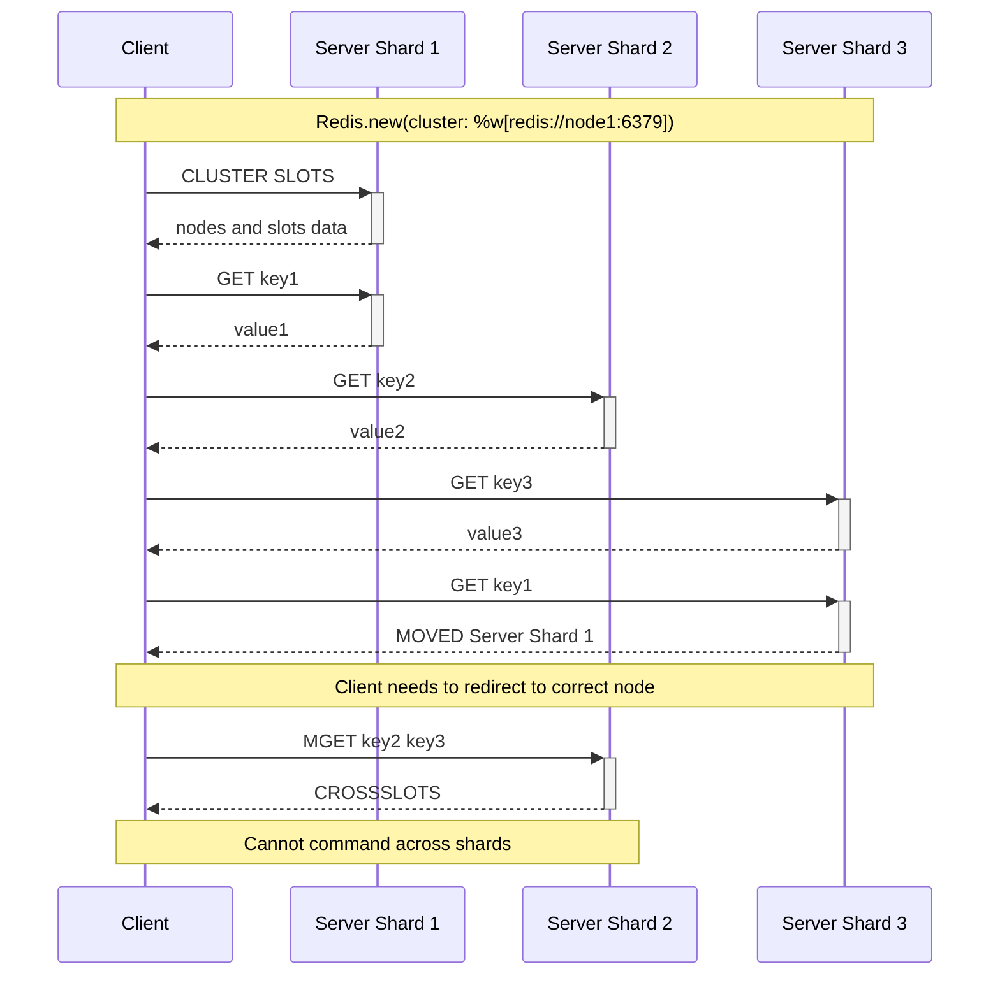

# How does cluster client work?

```mermaid
sequenceDiagram
    participant Client
    participant Server Shard 1
    participant Server Shard 2
    participant Server Shard 3
    Note over Client,Server Shard 3: Redis.new(cluster: %w[redis://node1:6379])
    Client->>+Server Shard 1: CLUSTER SLOTS
    Server Shard 1-->>-Client: nodes and slots data
    Client->>+Server Shard 1: GET key1
    Server Shard 1-->>-Client: value1
    Client->>+Server Shard 2: GET key2
    Server Shard 2-->>-Client: value2
    Client->>+Server Shard 3: GET key3
    Server Shard 3-->>-Client: value3
    Client->>+Server Shard 3: GET key1
    Server Shard 3-->>-Client: MOVED Server Shard 1
    Note over Client,Server Shard 3: Client needs to redirect to correct node
    Client->>+Server Shard 2: MGET key2 key3
    Server Shard 2-->>-Client: CROSSSLOTS
    Note over Client,Server Shard 2: Cannot command across shards
```
