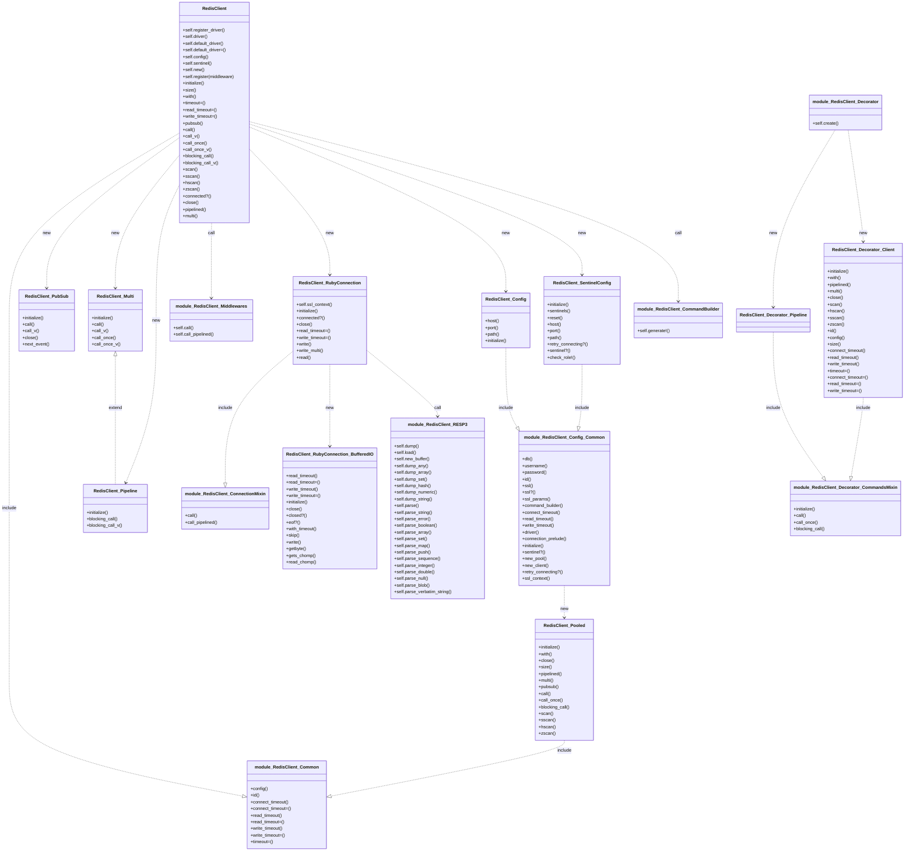

# [RedisClient](https://github.com/redis-rb/redis-client)

```mermaid
classDiagram
  class RedisClient {
    +self.register_driver()
    +self.driver()
    +self.default_driver()
    +self.default_driver=()
    +self.config()
    +self.sentinel()
    +self.new()
    +self.register(middleware)
    +initialize()
    +size()
    +with()
    +timeout=()
    +read_timeout=()
    +write_timeout=()
    +pubsub()
    +call()
    +call_v()
    +call_once()
    +call_once_v()
    +blocking_call()
    +blocking_call_v()
    +scan()
    +sscan()
    +hscan()
    +zscan()
    +connected?()
    +close()
    +pipelined()
    +multi()
  }

  class module_RedisClient_Common {
    +config()
    +id()
    +connect_timeout()
    +connect_timeout=()
    +read_timeout()
    +read_timeout=()
    +write_timeout()
    +write_timeout=()
    +timeout=()
  }

  class RedisClient_PubSub {
    +initialize()
    +call()
    +call_v()
    +close()
    +next_event()
  }

  class RedisClient_Multi {
    +initialize()
    +call()
    +call_v()
    +call_once()
    +call_once_v()
  }

  class RedisClient_Pipeline {
    +initialize()
    +blocking_call()
    +blocking_call_v()
  }

  class RedisClient_RubyConnection_BufferedIO {
    +read_timeout()
    +read_timeout=()
    +write_timeout()
    +write_timeout=()
    +initialize()
    +close()
    +closed?()
    +eof?()
    +with_timeout()
    +skip()
    +write()
    +getbyte()
    +gets_chomp()
    +read_chomp()
  }

  class module_RedisClient_RESP3 {
    +self.dump()
    +self.load()
    +self.new_buffer()
    +self.dump_any()
    +self.dump_array()
    +self.dump_set()
    +self.dump_hash()
    +self.dump_numeric()
    +self.dump_string()
    +self.parse()
    +self.parse_string()
    +self.parse_error()
    +self.parse_boolean()
    +self.parse_array()
    +self.parse_set()
    +self.parse_map()
    +self.parse_push()
    +self.parse_sequence()
    +self.parse_integer()
    +self.parse_double()
    +self.parse_null()
    +self.parse_blob()
    +self.parse_verbatim_string()
  }

  class module_RedisClient_CommandBuilder {
    +self.generate!()
  }

  class RedisClient_Config {
    +host()
    +port()
    +path()
    +initialize()
  }

  class module_RedisClient_Config_Common {
    +db()
    +username()
    +password()
    +id()
    +ssl()
    +ssl?()
    +ssl_params()
    +command_builder()
    +connect_timeout()
    +read_timeout()
    +write_timeout()
    +driver()
    +connection_prelude()
    +initialize()
    +sentinel?()
    +new_pool()
    +new_client()
    +retry_connecting?()
    +ssl_context()
  }

  class RedisClient_SentinelConfig {
    +initialize()
    +sentinels()
    +reset()
    +host()
    +port()
    +path()
    +retry_connecting?()
    +sentinel?()
    +check_role!()
  }

  class module_RedisClient_ConnectionMixin {
    +call()
    +call_pipelined()
  }

  class RedisClient_RubyConnection {
    +self.ssl_context()
    +initialize()
    +connected?()
    +close()
    +read_timeout=()
    +write_timeout=()
    +write()
    +write_multi()
    +read()
  }

  class module_RedisClient_Decorator {
    +self.create()
  }

  class module_RedisClient_Decorator_CommandsMixin {
    +initialize()
    +call()
    +call_once()
    +blocking_call()
  }

  class RedisClient_Decorator_Pipeline {
  }

  class RedisClient_Decorator_Client {
    +initialize()
    +with()
    +pipelined()
    +multi()
    +close()
    +scan()
    +hscan()
    +sscan()
    +zscan()
    +id()
    +config()
    +size()
    +connect_timeout()
    +read_timeout()
    +write_timeout()
    +timeout=()
    +connect_timeout=()
    +read_timeout=()
    +write_timeout=()
  }

  class module_RedisClient_Middlewares {
    +self.call()
    +self.call_pipelined()
  }

  class RedisClient_Pooled {
    +initialize()
    +with()
    +close()
    +size()
    +pipelined()
    +multi()
    +pubsub()
    +call()
    +call_once()
    +blocking_call()
    +scan()
    +sscan()
    +hscan()
    +zscan()
  }

  RedisClient ..|> module_RedisClient_Common : include
  RedisClient ..> RedisClient_PubSub : new
  RedisClient ..> RedisClient_Multi : new
  RedisClient ..> RedisClient_Pipeline : new
  RedisClient ..> module_RedisClient_Middlewares : call
  RedisClient ..> RedisClient_RubyConnection : new
  RedisClient ..> RedisClient_Config : new
  RedisClient ..> RedisClient_SentinelConfig : new
  RedisClient ..> module_RedisClient_CommandBuilder : call
  RedisClient_Multi <|.. RedisClient_Pipeline : extend

  RedisClient_Config ..|> module_RedisClient_Config_Common : include
  RedisClient_SentinelConfig ..|> module_RedisClient_Config_Common : include
  module_RedisClient_Config_Common ..> RedisClient_Pooled : new

  module_RedisClient_Decorator ..> RedisClient_Decorator_Pipeline : new
  module_RedisClient_Decorator ..> RedisClient_Decorator_Client : new
  RedisClient_Decorator_Pipeline ..|> module_RedisClient_Decorator_CommandsMixin : include
  RedisClient_Decorator_Client ..|> module_RedisClient_Decorator_CommandsMixin : include

  RedisClient_Pooled ..|> module_RedisClient_Common : include

  RedisClient_RubyConnection ..|> module_RedisClient_ConnectionMixin : include
  RedisClient_RubyConnection ..> RedisClient_RubyConnection_BufferedIO  : new
  RedisClient_RubyConnection ..> module_RedisClient_RESP3 : call
```
