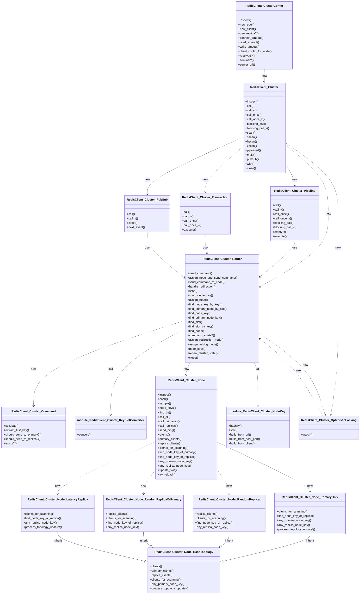

# RedisClient::Cluster

```mermaid
classDiagram
  class RedisClient_Cluster {
    +inspect()
    +call()
    +call_v()
    +call_once()
    +call_once_v()
    +blocking_call()
    +blocking_call_v()
    +scan()
    +sscan()
    +hscan()
    +zscan()
    +pipelined()
    +multi()
    +pubsub()
    +with()
    +close()
  }

  class RedisClient_ClusterConfig {
    +inspect()
    +new_pool()
    +new_client()
    +use_replica?()
    +connect_timeout()
    +read_timeout()
    +write_timeout()
    +client_config_for_node()
    +resolved?()
    +sentinel?()
    +server_url()
  }

  class RedisClient_Cluster_Command {
    +self.load()
    +extract_first_key()
    +should_send_to_primary?()
    +should_send_to_replica?()
    +exists?()
  }

  class module_RedisClient_Cluster_KeySlotConverter {
    +convert()
  }

  class RedisClient_Cluster_Node {
    +inspect()
    +each()
    +sample()
    +node_keys()
    +find_by()
    +call_all()
    +call_primaries()
    +call_replicas()
    +send_ping()
    +clients()
    +primary_clients()
    +replica_clients()
    +clients_for_scanning()
    +find_node_key_of_primary()
    +find_node_key_of_replica()
    +any_primary_node_key()
    +any_replica_node_key()
    +update_slot()
    +try_reload!()
  }

  class RedisClient_Cluster_Node_BaseTopology {
    +clients()
    +primary_clients()
    +replica_clients()
    +clients_for_scanning()
    +any_primary_node_key()
    +process_topology_update!()
  }

  class RedisClient_Cluster_Node_PrimaryOnly {
    +clients_for_scanning()
    +find_node_key_of_replica()
    +any_primary_node_key()
    +any_replica_node_key()
    +process_topology_update!()
  }

  class RedisClient_Cluster_Node_RandomReplica {
    +replica_clients()
    +clients_for_scanning()
    +find_node_key_of_replica()
    +any_replica_node_key()
  }

  class RedisClient_Cluster_Node_RandomReplicaOrPrimary {
    +replica_clients()
    +clients_for_scanning()
    +find_node_key_of_replica()
    +any_replica_node_key()
  }

  class RedisClient_Cluster_Node_LatencyReplica {
    +clients_for_scanning()
    +find_node_key_of_replica()
    +any_replica_node_key()
    +process_topology_update!()
  }

  class module_RedisClient_Cluster_NodeKey {
    +hashify()
    +split()
    +build_from_uri()
    +build_from_host_port()
    +build_from_client()
  }

  class RedisClient_Cluster_Pipeline {
    +call()
    +call_v()
    +call_once()
    +call_once_v()
    +blocking_call()
    +blocking_call_v()
    +empty?()
    +execute()
  }

  class RedisClient_Cluster_Transaction {
    +call()
    +call_v()
    +call_once()
    +call_once_v()
    +execute()
  }

  class RedisClient_Cluster_OptimisticLocking {
    +watch()
  }

  class RedisClient_Cluster_PubSub {
    +call()
    +call_v()
    +close()
    +next_event()
  }

  class RedisClient_Cluster_Router {
    +send_command()
    +assign_node_and_send_command()
    +send_command_to_node()
    +handle_redirection()
    +scan()
    +scan_single_key()
    +assign_node()
    +find_node_key_by_key()
    +find_primary_node_by_slot()
    +find_node_key()
    +find_primary_node_key()
    +find_slot()
    +find_slot_by_key()
    +find_node()
    +command_exists?()
    +assign_redirection_node()
    +assign_asking_node()
    +node_keys()
    +renew_cluster_state()
    +close()
  }

  RedisClient_ClusterConfig ..> RedisClient_Cluster : new

  RedisClient_Cluster ..> RedisClient_Cluster_Pipeline : new
  RedisClient_Cluster ..> RedisClient_Cluster_Transaction : new
  RedisClient_Cluster ..> RedisClient_Cluster_OptimisticLocking : new
  RedisClient_Cluster ..> RedisClient_Cluster_PubSub : new
  RedisClient_Cluster ..> RedisClient_Cluster_Router : new

  RedisClient_Cluster_Pipeline ..> RedisClient_Cluster_Router : use
  RedisClient_Cluster_Transaction ..> RedisClient_Cluster_Router : use
  RedisClient_Cluster_OptimisticLocking ..> RedisClient_Cluster_Router : use
  RedisClient_Cluster_PubSub ..> RedisClient_Cluster_Router : use

  RedisClient_Cluster_Router ..> RedisClient_Cluster_Node : new
  RedisClient_Cluster_Router ..> RedisClient_Cluster_Command : new
  RedisClient_Cluster_Router ..> RedisClient_Cluster_OptimisticLocking : new
  RedisClient_Cluster_Router ..> module_RedisClient_Cluster_KeySlotConverter : call
  RedisClient_Cluster_Router ..> module_RedisClient_Cluster_NodeKey : call

  RedisClient_Cluster_Node_PrimaryOnly --|> RedisClient_Cluster_Node_BaseTopology : inherit
  RedisClient_Cluster_Node_RandomReplica --|> RedisClient_Cluster_Node_BaseTopology : inherit
  RedisClient_Cluster_Node_RandomReplicaOrPrimary --|> RedisClient_Cluster_Node_BaseTopology : inherit
  RedisClient_Cluster_Node_LatencyReplica --|> RedisClient_Cluster_Node_BaseTopology : inherit
  RedisClient_Cluster_Node ..> RedisClient_Cluster_Node_PrimaryOnly : new
  RedisClient_Cluster_Node ..> RedisClient_Cluster_Node_RandomReplica : new
  RedisClient_Cluster_Node ..> RedisClient_Cluster_Node_RandomReplicaOrPrimary : new
  RedisClient_Cluster_Node ..> RedisClient_Cluster_Node_LatencyReplica : new
```
