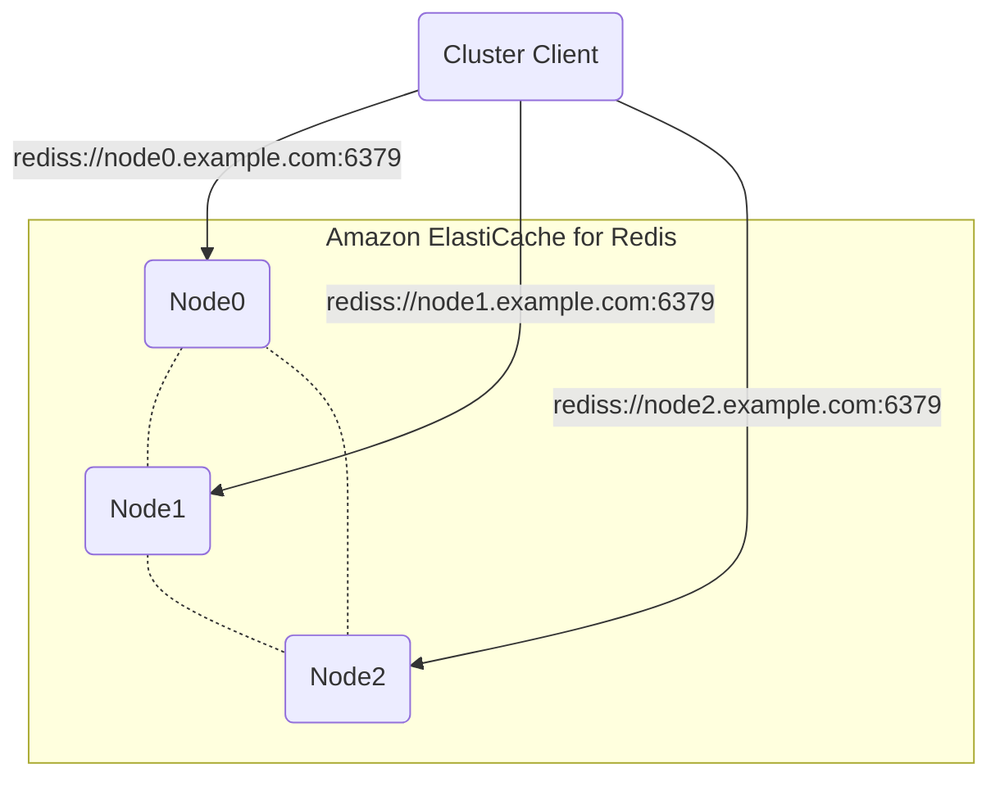
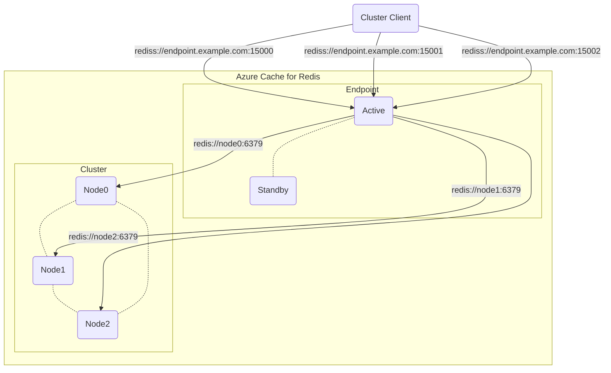

# Architectures of Redis cluster with SSL/TLS as imagined

## AWS
The client can connect to the nodes directly.
The endpoint is just a CNAME record of DNS.
It is as simple as that.

## Microsoft Azure
The service provides a single IP address and multiple ports mapped to each node.
The endpoint doesn't support redirection.
It does only SSL/TLS termination.

